# Urchin ZMK Config

ZMK firmware configuration for a wireless Urchin split keyboard on nice!nano-compatible controllers.

This layout is based on the MoErgo GO60/TailorKey layout ideas documented here:

https://sites.google.com/view/tailorkey/moergo/go60

The keymap adapts the Corne GO60-style layout to the Urchin 3x5+2 layout, with bilateral home-row modifiers, thumb-driven navigation layers, and a Magic utility layer.

## Firmware Notes

- Root build artifacts are expected as `urchin_left.uf2` and `urchin_right.uf2`.
- The Urchin keymap intentionally drops the Corne outer columns and maps the retained four thumb keys to Backspace, Tab, Enter, and Space.
- The visual layer reference is generated from `config/urchin.keymap` using the physical coordinates in `config/urchin.json`.

## Magic Layer

The Magic layer is reached by holding `Z` on the base layer. Tapping `Z` still sends `Z`.

Magic provides firmware and connectivity controls:

- Bootloader and reset keys on both outer columns.
- Media controls for mute, volume down, and volume up.
- Bluetooth profile selection for profiles 0-3 and Bluetooth clear.
- USB output selection.
- Quick return to base and autoshift layer access.

## Visual Layer Reference

Static SVGs are generated from `config/urchin.keymap` with Catppuccin Macchiato colors and the Urchin physical layout from `config/urchin.json`. Regenerate them after keymap changes with:

```bash
node scripts/generate-keymap-svgs.mjs
```

### Base Layers

#### 0: HRM macOS

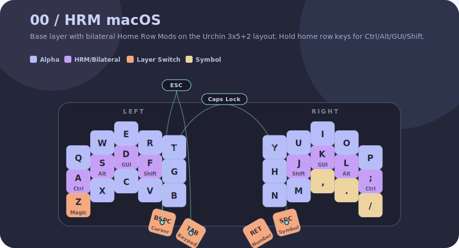

#### 1: Typing

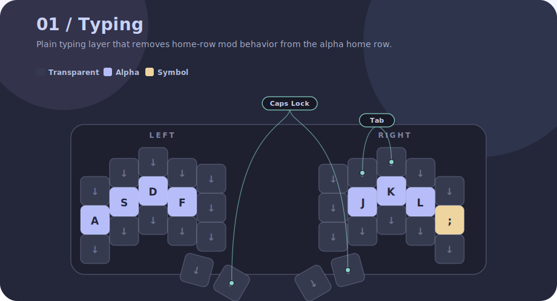

#### 2: Autoshift

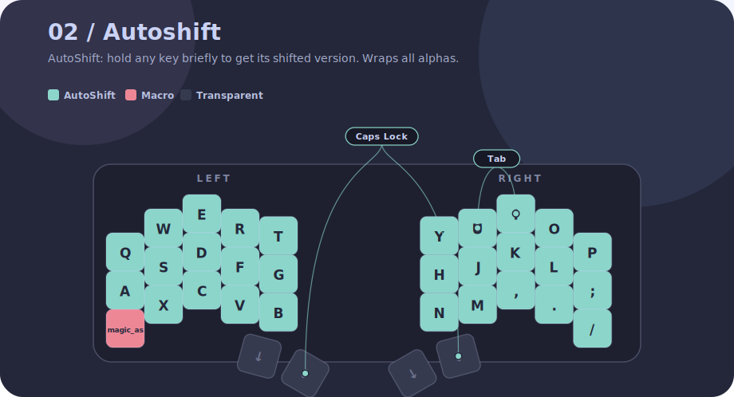

### Bilateral HRM Helper Layers

#### 3: L-Pinky

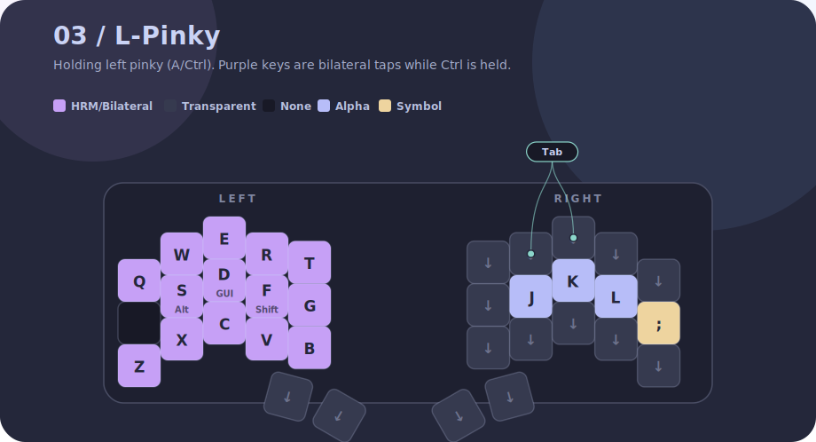

#### 4: L-Ring

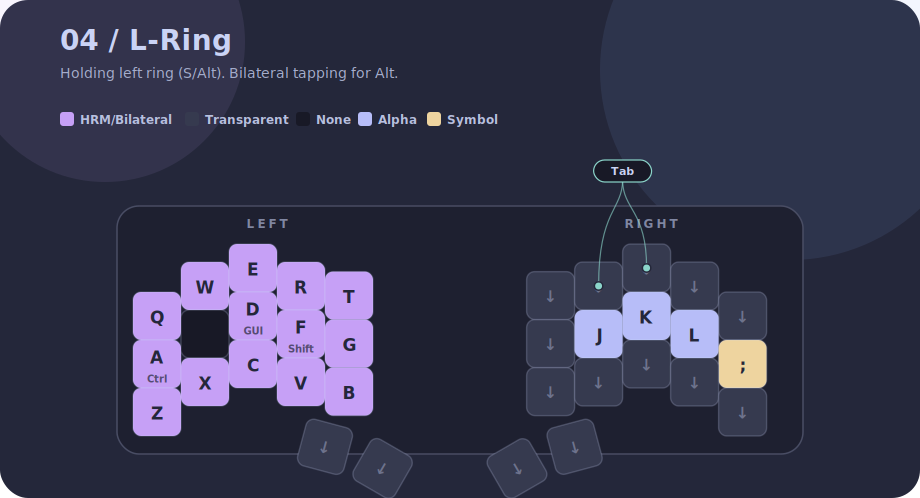

#### 5: L-Middle

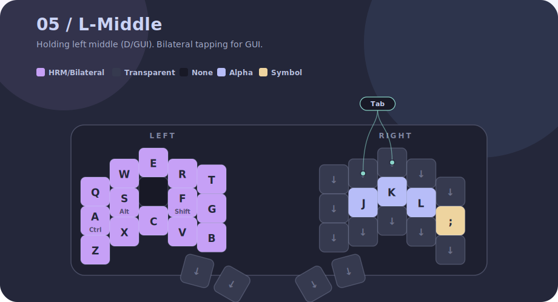

#### 6: L-Index

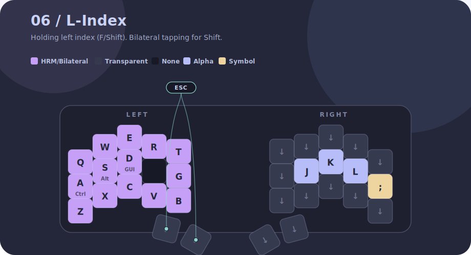

#### 7: R-Pinky

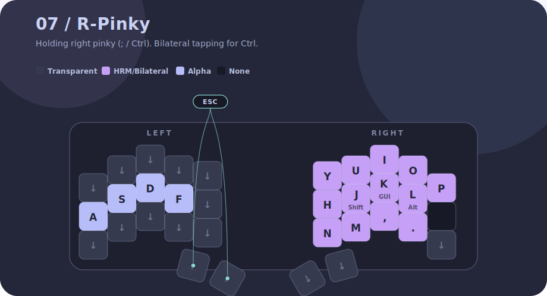

#### 8: R-Ring

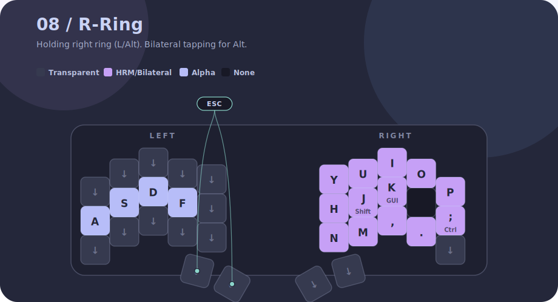

#### 9: R-Middle

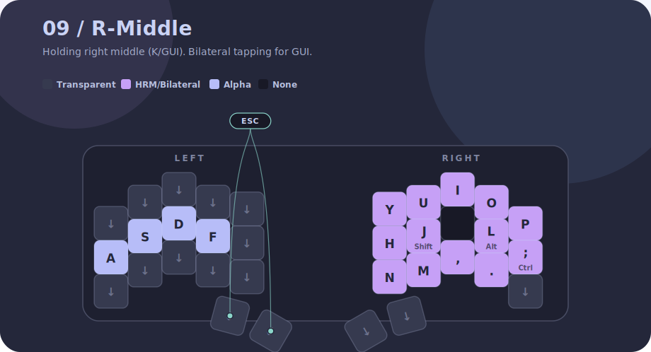

#### 10: R-Index

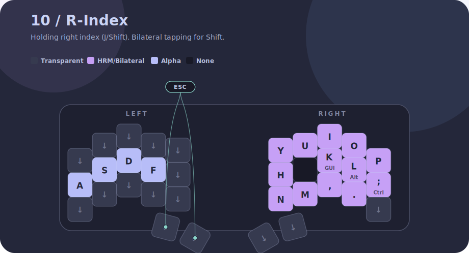

### Functional Layers

#### 11: Cursor

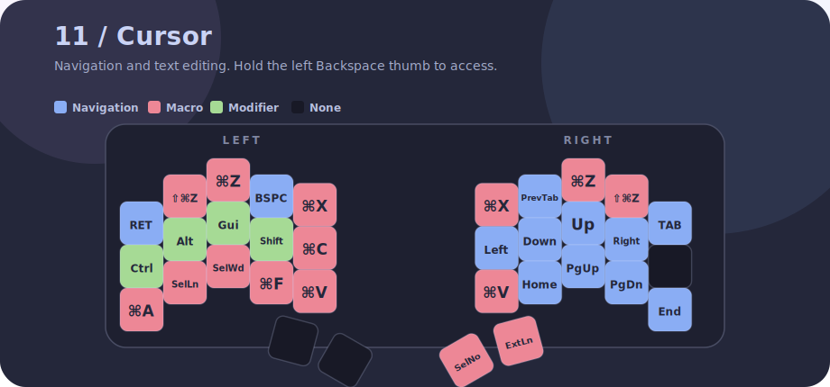

#### 12: Keypad

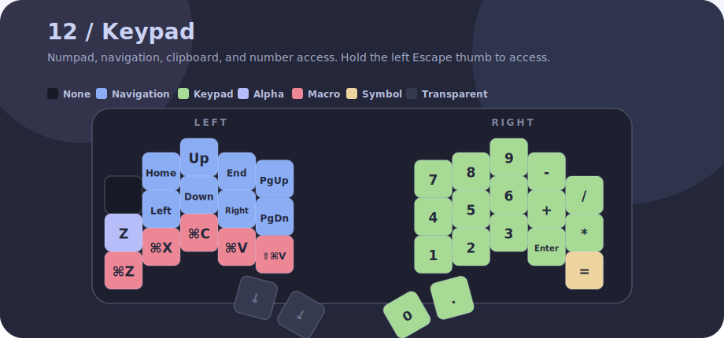

#### 13: Symbol

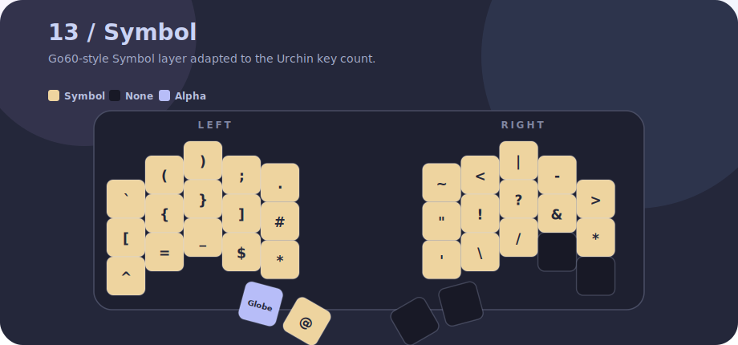

#### 14: Magic

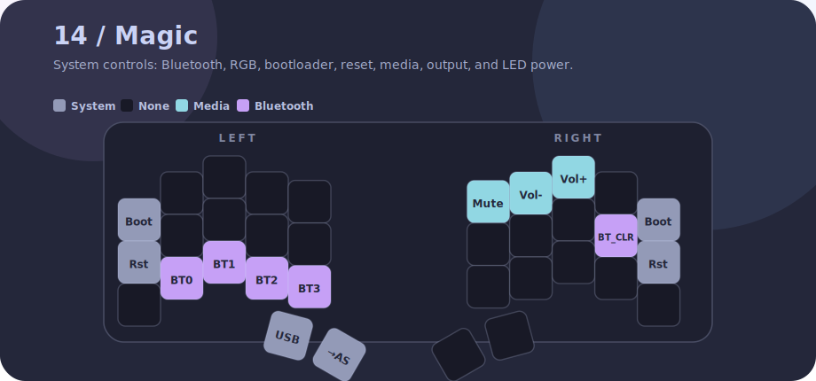

#### 15: Number

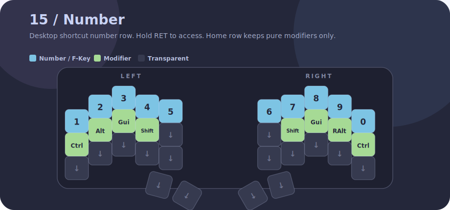
